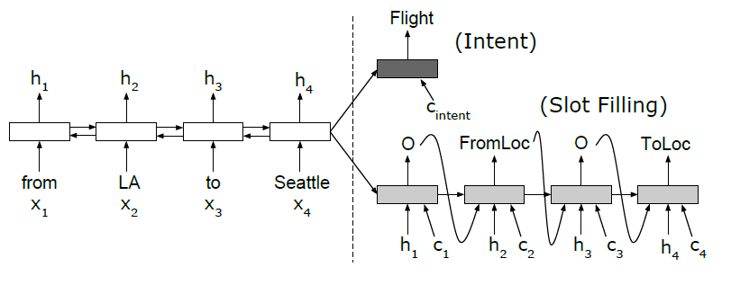
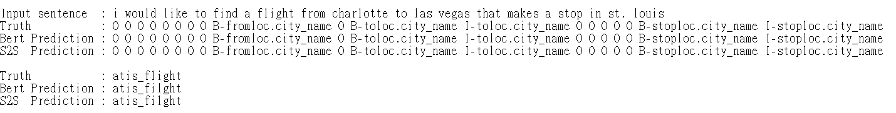

# Joint_learn  
Pytorch implementation of below Model  
   * `JointBert`:[BERT for Joint Intent Classification and Slot Filling](https://arxiv.org/abs/1902.10909)  
   * `AttnSeq2Seq`:[Attention-Based Recurrent Neural Network Models for Joint Intent Detection and Slot Filling](https://arxiv.org/abs/1609.01454)  
  
## Model Architecture  
  
#### 1.JoinBert
Architecture is referenced to [monologg/JointBERT](https://github.com/monologg/JointBERT).Please click to see detail.   
    - Predict `intent` and `slot` at the same time from **one BERT model** (=Joint model)  
    - total_loss = intent_loss + coef \* slot_loss (Change coef with `--slot_loss_coef` option)  
    - **If you want to use CRF layer, give `--use_crf` option**  
  
#### 2.AttnSeq2Seq
  


**Using Attention mechanism based on RNN Encoder-Decoder.**  

    - Encoder part  
     1. Bidirectional Rnn(LSTM) to encode source sents.
     2. Backward Lstm final hidden state to compute deocder init hidden state.  
      
    - Attenion part
     1.Using neural network,last hidden state,encoder hiddens to compute  attention weight.
     2.using softmax to gain weight  
     
    - Decoder part
     1.To predict current slots,feed last hidden state,last predict label,aligned encoder hidden,
       context vector.  
     2.using last hidden state & encoder hiddens to compute current context vector  
     3.using init decoder hidden & it's context to compute intent classification  
     4.total_loss= intent_loss + coef * slot_loss   

## Dependencies  
- python>=3.7
- torch==1.5.1
- seqeval==1.2.2
- transformers==4.3.0
- pytorch-crf==0.7.2
  
## Dataset
|       | Train  | Dev | Test | Intent Labels | Slot Labels |
| ----- | ------ | --- | ---- | ------------- | ----------- |
| ATIS  | 4,478  | 500 | 893  | 21            | 120         |
| Snips | 13,084 | 700 | 700  | 7             | 72          |

- The number of labels are based on the _train_ dataset.
- Add `UNK` for labels (For intent and slot labels which are only shown in _dev_ and _test_ dataset)
- Add `PAD` for slot label

## Train & Evaluation (Usage)
  
```bash  
$ python main.py --task {task_name} \
                 --model_type {model_type} \
                 --model_dir {model_dir_name} \
                 --do_train --do_eval \
                 --use_crf

#For ATIS
$ python main.py --task atis \
                 --model_type joint_bert \
                 --model_dir ./atis_model/joint_bert \
                 --do_train --do_eval 

#For Snips
$ python main.py --task snips \
                 --model_type joint_bert \
                 --model_dir ./snips_model/joint_bert \
                 --do_train --do_eval 
```  
  
## Prediction  
  
```bash  
$ python predict.py --input_file {Input_file} --output_file {Output_file} --model_dir {Model_dir} --model_type {Model_type}
```  
## Default hyperparams setting  
- BERT: Lr=1e-4 warm_steps=248 max_norm=1 train_epochs=10 dropout=0.1
- Seq2Seq+Attention: lr=1e-3 train_epochs=10 dropout=0.1
## Results  
  
- Run 5 ~ 10 epochs (Record the best result)
- Only test with `uncased` model
- Warm up steps 248 is the best
- Seq2Seq model's teach forcing ratio is 0.5 

|           |                  | Intent acc (%) | Slot F1 (%) | Sentence acc (%) |
| --------- | ---------------- | -------------- | ----------- | ---------------- |
| **Snips** | BERT             | **99.14**      | 96.11       | **99.0**         |
|           | BERT + CRF       | 98.85          | 95.81       | 98.71            |
|           | Seq2Seq+Attention| 98.14          | 95.07       | 97.57            |
| **ATIS**  | BERT             | 97.4           | **98.07**   | 97.40            |
|           | BERT + CRF       | 97.8           | 98.07       | 97.80            |
|           | Seq2Seq+Attention| 98.2           | 96.8        | 98.20            |


## Sentence predict Result  
  
## References  
  
- [Huggingface Transformers](https://github.com/huggingface/transformers)  
- [pytorch-crf](https://github.com/kmkurn/pytorch-crf)  
- [monologg/JointBERT](https://github.com/monologg/JointBERT)